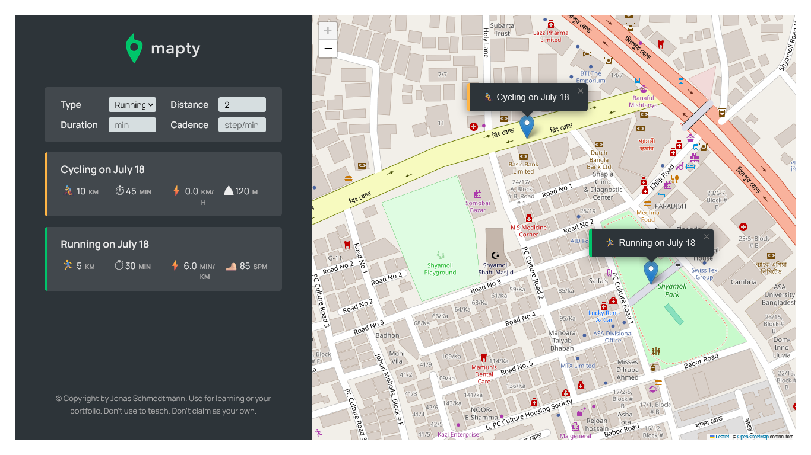

# 🗺️ Mapty App

This is a geo-based workout tracker app built during the [**"The Complete JavaScript Course 2025: From Zero to Expert!"**](https://www.udemy.com/the-complete-javascript-course/?couponCode=C3GITHUB10) by **Jonas Schmedtmann**.

It allows users to **log running and cycling workouts** directly on a map using the **Leaflet.js** library and the browser's **Geolocation API**.

---

## 🚀 How to Use

1. **Click this** [**Mapty**](https://darkoray.github.io/Mapty/).
2. **Allow location access** when prompted — this centers the map on your current position.
3. **Click on the map** where you want to log a workout.
4. **Fill in the form** (type, distance, duration, and cadence/elevation depending on type).
5. **Submit the form** to add the workout.
6. The workout will appear both:

   - As a **marker** on the map.
   - In a **list below** the map.

7. **Click on a workout in the list** to pan/zoom the map to that workout's location.
8. **How to Clear All Workouts**:

   - **Open DevTools** in your browser (F12 or right-click → Inspect).
   - Go to the **Console** tab.
   - Type the following and press Enter:

```js
app.reset();
```

---

## ✅ Features

- Log workouts with **location, distance, duration, and cadence/elevation**
- 🏃 Choose between **Running** or **Cycling**
- 🗺️ Display all workouts on an interactive **Leaflet map**
- 📝 View detailed workout stats in a **list UI**
- 💾 Automatically **save workouts to localStorage**
- 🔁 **Persist data** across browser reloads
- 🎯 **Pan/zoom** to a workout on the map when clicked from the list
- 🧼 Easy way to **reset** all saved data from DevTools

---

## 🛠️ Technologies Used

- **HTML5**
- **CSS3**
- **JavaScript (ES6+)**

  - Classes and OOP
  - Geolocation API
  - Private class fields

- **Leaflet.js** (for map rendering and interaction)

---



---

## 📄 License & Credits

This project is part of a course and provided for **learning purposes only**.

© by [Jonas Schmedtmann](https://twitter.com/jonasschmedtman).
You can use it for your portfolio or learning.
Don't use it to teach or redistribute as your own work.
